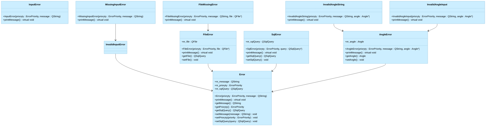

```mermaid

%%{init: {'theme':'base', 'themeVariables': { 'primaryColor': '#cceeff', 'classText': '#000' }}}%%
classDiagram
    class Error {
        +m_message : QString
        +m_prioryty : ErrorPriority
        +m_sqlQuery : QSqlQuery*

        +Error(prioryty : ErrorPriority, message : QString)
        +printMessage() virtual void 

        +getMessage() QString 
        +getPrioryty() ErrorPriority
        +getSqlQuery() QSqlQuery
        +setMessage(message : QString)void
        +setPrioryty(priority : ErrorPriority) void
        +setSqlQuery(query : QSqlQuery) void
    }
    
    class InputError {
        +InputError(prioryty : ErrorPriority, message : QString)
        +printMessage() virtual void 
    }

    class MissingInputError {
        +MissingInputError(prioryty : ErrorPriority, message : QString)
        +printMessage() virtual void 
    }

    class FileError {
        +m_file : QFile*

        +FileError(prioryty : ErrorPriority, file : QFile*)
        +printMessage() virtual void

        +getFile() QSqlQuery
        +setFile() void
    }

    class FileMissingError {
        +FileMissingError(prioryty : ErrorPriority, message : QString, file : QFile*)
        +printMessage() virtual void 
    }

    class SqlError {
        +m_sqlQuery : QSqlQuery*

        +SqlError(prioryty : ErrorPriority, query : QSqlQuery*)
        +printMessage() virtual void

        +getSqlQuery() QSqlQuery
        +setSqlQuery() void
    }

    class AngleError {
        +m_angle : Angle*

        +AngleError(prioryty : ErrorPriority, message : QString, angle : Angle*)
        +printMessage() virtual void

        +getAngle() Angle
        +setAngle() void
    }

    class InvalidAngleString {
        +InvalidAngleString(prioryty : ErrorPriority, message : QString, angle : Angle*)
        +printMessage() virtual void 
    }

    class InvalidAngleInput {
        +InvalidAngleInput(prioryty : ErrorPriority, message : QString, angle : Angle*)
        +printMessage() virtual void 
    }

    InvalidInputError --> Error
    MissingInputError --> InvalidInputError
    FileError --> Error
    FileMissingError --> FileError
    SqlError --> Error
    AngleError --> Error
    InvalidAngleString --> AngleError
    InvalidAngleInput --> AngleError

```