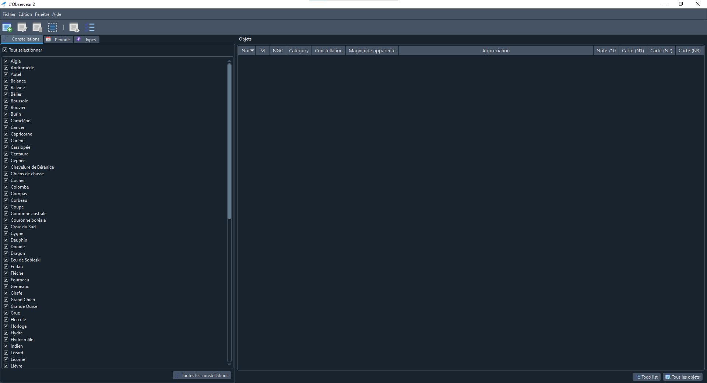
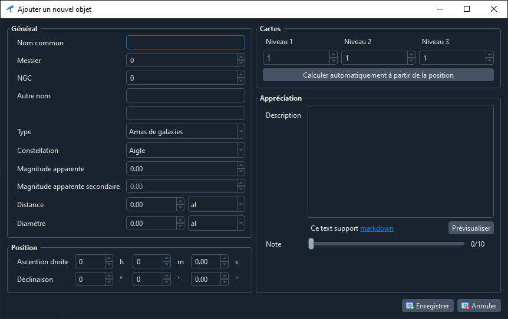

# L'Observeur 2

<div style="text-align:center"></div>

L'observeur 2 est une application QT6 qui permet l’édition et la visualisation d'un catalogue d'objets astronomique pour amateurs.

## Index

- Objectifs
- Dépendances
- Installation
- Architecture

## Objectifs

### Problématique

Il existe plusieurs catalogues d'objets du ciel profond (Messier, NGC, Herschel, IC, etc…). Cependant, ces catalogues sont souvent immenses et difficile à trier selon la période de l'année, les instruments à disposition ou même les préférences de chacun.

### Fonctionnalités

L'observeur 2 doit être une interface simple pour visualiser, modifier ou créer une base de données personnalisé pour chaque astronome. Toutefois, cette base de données doit être suffisamment complète pour répondre à des besoins pratique. Par exemple, la visibilité des objets par rapport aux saisons. Le logicielle doit aussi connaitre la position de l'observateur pour adapter le contenu.

### Partage

La base de données doit être contenu dans un fichier non chiffré pour permettre le partage entre plusieurs personnes facilement.




## Dépendances

- QT6
- Compilateur
- QDarkStyleSheet

### QT6

Qt6 SDK : [téléchargement](https://www.qt.io/download)

### Compilateur

MinGW 32bit-64bit : [téléchargement](http://mingw-w64.org/doku.php/download)

### QDarkStyleSheet

QDarkStyleSheet est un excellent repository de feuille de style pour des application QT : [repository GitHub](https://github.com/ColinDuquesnoy/QDarkStyleSheet)

## Installation

### Installation pour Windows

Alpha disponible dans la [section release](https://github.com/Paracetamol56/Observeur2/releases/tag/alpha-0.1.1)

**Etapes d'installation :**
- Télécharger le fichier zip et l'extraie n'importe où sur votre ordinateur
- Télécharger la base de données (le fichier *emptyDatabase.sqlite*) et le déplacer n'importe où sur votre ordinateur
- Lancer l'application avec l'executable (*Observeur2.exe*)
- Lors du premier démarrage, une fenetre de réglage apparait, remplissez les champs et choisissez le chemin de la base de données

### Installation pour Linux

Pas encore disponible

### Installation pour le developpement

- Installer QT5, il aussi est préférable d'utiliser QTCreator pour pouvoir éditer facilement les interfaces xml.
- Cloner ce repository.
- La compilation est assurée par QMake, vous n'avez qu'à importer le fichier .pro dans QTCreator.

## Architecture

### Model conceptuelle de données pour la base de donnée

![MCD](https://mermaid.ink/svg/eyJjb2RlIjoiY2xhc3NEaWFncmFtXG4gICAgY2xhc3Mgb2JqZWN0cyB7XG4gICAgICAgIG9iamVjdF9pZCA6IGludFxuICAgICAgICBvYmplY3RfbmFtZSA6IHZhcmNoYXJcbiAgICAgICAgb2JqZWN0X21lc3NpZXIgOiBpbnRcbiAgICAgICAgb2JqZWN0X25nYyA6IGludFxuICAgICAgICBvYmplY3Rfb3RoZXJuYW1lMSA6IHZhcmNoYXJcbiAgICAgICAgb2JqZWN0X290aGVybmFtZTIgOiB2YXJjaGFyXG4gICAgICAgIG9iamVjdF9jYXRlZ29yeSA6IGludFxuICAgICAgICBvYmplY3RfY29uc3RlbGxhdGlvbiA6IGludFxuICAgICAgICBvYmplY3RfYXBwYXJlbnRfbWFnbml0dWRlIDogZG91YmxlXG4gICAgICAgIG9iamVjdF9zZWNvbmRhcnlfbWFnbml0dWRlIDogZG91YmxlXG4gICAgICAgIG9iamVjdF9yaWdodF9hc2NlbnNpb24gOiB2YXJjaGFyXG4gICAgICAgIG9iamVjdF9kZWNsaW5hdGlvbiA6IHZhcmNoYXJcbiAgICAgICAgb2JqZWN0X2FwcHJlY2lhdGlvbiA6IHRleHRcbiAgICAgICAgb2JqZWN0X25vdGUgOiBpbnRcbiAgICAgICAgb2JqZWN0X3NreW1hcDFfaWQgOiBpbnRcbiAgICAgICAgb2JqZWN0X3NreW1hcDJfaWQgOiBpbnRcbiAgICAgICAgb2JqZWN0X3NreW1hcDNfaWQgOiBpbnRcbiAgICAgICAgb2JqZWN0X2Rpc3RhbmNlIDogZG91YmxlXG4gICAgICAgIG9iamVjdF9kaWFtZXRyZSA6IGRvdWJsZVxuICAgIH1cbiAgICBcbiAgICBjbGFzcyBjYXRlZ29yaWVzIHtcbiAgICAgICAgY2F0ZWdvcnlfaWQgOiBpbnRcbiAgICAgICAgY2F0ZWdvcnlfbmFtZSA6IHZhcmNoYXJcbiAgICAgICAgY2F0ZWdvcnlfZGVzY3JpcHRpb24gOiB0ZXh0XG4gICAgfVxuXG4gICAgY2xhc3MgY29uc3RlbGxhdGlvbnMge1xuICAgICAgICBjb25zdGVsbGF0aW9uc19pZCA6IGludFxuICAgICAgICBjb25zdGVsbGF0aW9uc19uYW1lIDogdmFyY2hhclxuICAgICAgICBjb25zdGVsbGF0aW9uc19sYXRpbl9uYW1lIDogdmFyY2hhclxuICAgICAgICBjb25zdGVsbGF0aW9uc19hYnJldmlhdGlvbiA6IHZhcmNoYXJcbiAgICAgICAgY29uc3RlbGxhdGlvbnNfZXh0ZW50X3NxdWFyZWRlZyA6IGZsb2F0XG4gICAgICAgIGNvbnN0ZWxsYXRpb25zX2V4dGVudF9wZXJjZW50IDogZmxvYXRcbiAgICAgICAgY29uc3RlbGxhdGlvbnNfcmlnaHRfYXNjZW5zaW9uIDogdmFyY2hhclxuICAgICAgICBjb25zdGVsbGF0aW9uc19kZWNsaW5hdGlvbiA6IHZhcmNoYXJcbiAgICB9XG5cbiAgICBjbGFzcyBza3ltYXAxIHtcbiAgICAgICAgc2t5bWFwMV9pZCA6IGludFxuICAgICAgICBza3ltYXAxX251bWJlcnIgOiBpbnRcbiAgICAgICAgc2t5bWFwMV9yaWdodF9hc2NlbnNpb24gOiB2YXJjaGFyXG4gICAgICAgIHNreW1hcDFfZGVjbGluYXRpb24gOiB2YXJjaGFyXG4gICAgfVxuXG4gICAgY2xhc3Mgc2t5bWFwMiB7XG4gICAgICAgIHNreW1hcDJfaWQgOiBpbnRcbiAgICAgICAgc2t5bWFwMl9udW1iZXJyIDogaW50XG4gICAgICAgIHNreW1hcDJfcmlnaHRfYXNjZW5zaW9uIDogdmFyY2hhclxuICAgICAgICBza3ltYXAyX2RlY2xpbmF0aW9uIDogdmFyY2hhclxuICAgIH1cblxuICAgIGNsYXNzIHNreW1hcDMge1xuICAgICAgICBza3ltYXAzX2lkIDogaW50XG4gICAgICAgIHNreW1hcDNfbnVtYmVyciA6IGludFxuICAgICAgICBza3ltYXAzX3JpZ2h0X2FzY2Vuc2lvbiA6IHZhcmNoYXJcbiAgICAgICAgc2t5bWFwM19kZWNsaW5hdGlvbiA6IHZhcmNoYXJcbiAgICB9XG5cbiAgICBvYmplY3RzIFwiMS4uMVwiIC0tIFwiMC4ublwiIGNhdGVnb3JpZXMgOiBjYXRlZ29yeV9pZCA9IG9iamVjdF9jYXRlZ29yeVxuICAgIG9iamVjdHMgXCIxLi4xXCIgLS0gXCIwLi5uXCIgY29uc3RlbGxhdGlvbnMgOiBjb25zdGVsbGF0aW9uc19pZCA9IG9iamVjdF9jb25zdGVsbGF0aW9uXG4gICAgb2JqZWN0cyBcIjEuLjFcIiAtLSBcIjAuLm5cIiBza3ltYXAxIDogc2t5bWFwMV9pZCA9IG9iamVjdF9za3ltYXAxX2lkXG4gICAgb2JqZWN0cyBcIjEuLjFcIiAtLSBcIjAuLm5cIiBza3ltYXAyIDogc2t5bWFwMl9pZCA9IG9iamVjdF9za3ltYXAyX2lkXG4gICAgb2JqZWN0cyBcIjEuLjFcIiAtLSBcIjAuLm5cIiBza3ltYXAzIDogc2t5bWFwM19pZCA9IG9iamVjdF9za3ltYXAzX2lkIiwibWVybWFpZCI6eyJzZWN1cml0eUxldmVsIjoibG9vc2UiLCJ0aGVtZSI6ImJhc2UiLCJ0aGVtZVZhcmlhYmxlcyI6eyJwcmltYXJ5Q29sb3IiOiIjY2NlZWZmIiwiY2xhc3NUZXh0IjoiIzAwMDAwMCJ9fSwidXBkYXRlRWRpdG9yIjpmYWxzZSwiYXV0b1N5bmMiOnRydWUsInVwZGF0ZURpYWdyYW0iOmZhbHNlfQ)

<!--

-->

### Hiérarchie des erreurs

``` text
Error
├──InputError
│   └──MissingInputError
├──FileError
│   └──MissingFileError
├──SqlError
└──AngleError
    ├──InvalidAngleString
    └──InvalidAngleInput
```

